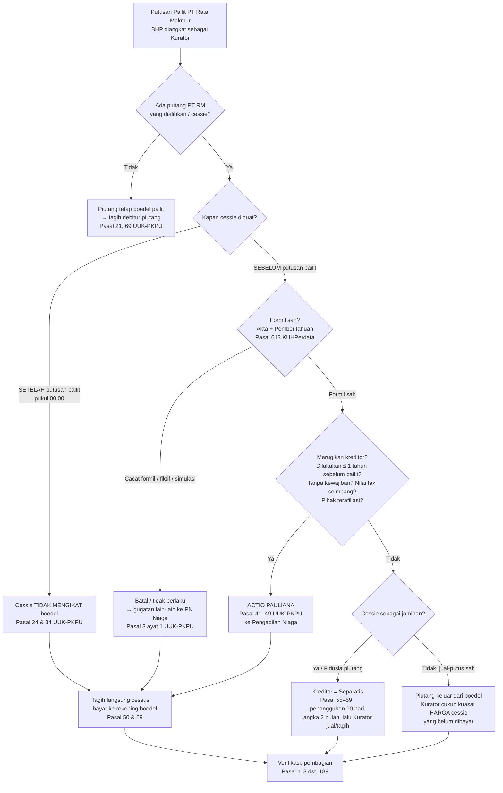
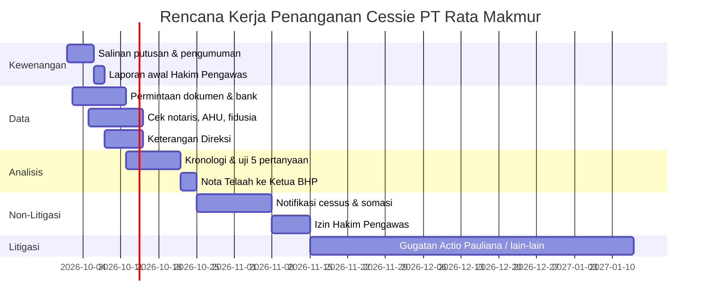

# TELAAH HUKUM
## Pengalihan Piutang (Cessie) dalam Kepailitan PT Rata Makmur (Dalam Pailit)
### Balai Harta Peninggalan (BHP) selaku Kurator

> **Sifat dokumen:** Telaah internal / kertas kerja Kurator.
> **Catatan penting:** Data faktual yang ditandai `[ ... ]` wajib dilengkapi dari berkas perkara (putusan, akta cessie, surat notifikasi, laporan keuangan). Kesimpulan akhir bergantung pada **tanggal** dan **isi** akta cessie.

---

## DAFTAR ISI

1. [Peta Berpikir (Ringkas)](#1-peta-berpikir-ringkas)
2. [Duduk Perkara & Data yang Harus Dipastikan](#2-duduk-perkara--data-yang-harus-dipastikan)
3. [Dasar Hukum](#3-dasar-hukum)
4. [Kedudukan BHP sebagai Kurator](#4-kedudukan-bhp-sebagai-kurator)
5. [Memahami Cessie secara Benar](#5-memahami-cessie-secara-benar)
6. [Uji Cessie terhadap Kepailitan — 5 Pertanyaan Kunci](#6-uji-cessie-terhadap-kepailitan--5-pertanyaan-kunci)
7. [Skenario & Konsekuensi Hukum](#7-skenario--konsekuensi-hukum)
8. [Langkah-Langkah BHP (Tahap demi Tahap)](#8-langkah-langkah-bhp-tahap-demi-tahap)
9. [Matriks: Langkah – Berkas – Tujuan – Pasal](#9-matriks-langkah--berkas--tujuan--pasal)
10. [Daftar Periksa Berkas (Checklist)](#10-daftar-periksa-berkas-checklist)
11. [Risiko & Mitigasi](#11-risiko--mitigasi)
12. [Kesimpulan & Rekomendasi](#12-kesimpulan--rekomendasi)
13. [Lampiran Draf Surat](#13-lampiran-draf-surat)

---

## 1. PETA BERPIKIR (RINGKAS)

Alur logika telaah ini — dibaca dari atas ke bawah:



**Intinya dalam satu kalimat:**
> Sejak putusan pailit, **hanya Kurator (BHP)** yang berwenang atas piutang PT Rata Makmur. Setiap cessie harus diuji dari sisi **waktu**, **keabsahan formil**, **itikad/kerugian bagi kreditor**, dan **fungsinya (jual-putus atau jaminan)**; hasil uji itulah yang menentukan apakah BHP **menagih langsung**, **menggugat pembatalan (actio pauliana)**, atau **memperlakukan penerima cessie sebagai kreditor separatis/konkuren**.

---

## 2. DUDUK PERKARA & DATA YANG HARUS DIPASTIKAN

### 2.1 Kerangka Fakta

| No | Fakta | Isi / Sumber | Status |
|---|---|---|---|
| 1 | Nomor & tanggal putusan pailit | `[No. .../Pdt.Sus-Pailit/20../PN Niaga ...]` tgl `[...]` | ☐ |
| 2 | Hakim Pengawas | `[nama]` | ☐ |
| 3 | Kurator | Balai Harta Peninggalan `[Medan]` | ☐ |
| 4 | Asal kepailitan | Permohonan kreditor / PKPU gagal (Pasal 230 / 285 / 291) | ☐ |
| 5 | Objek cessie (piutang apa, terhadap siapa/cessus) | `[kontrak/invoice/tagihan ke ...]` | ☐ |
| 6 | Cedent | PT Rata Makmur | ☐ |
| 7 | Cessionaris (penerima) | `[nama; terafiliasi? pemegang saham/direksi/grup?]` | ☐ |
| 8 | Bentuk & tanggal akta cessie | Akta notaris / bawah tangan, tgl `[...]` | ☐ |
| 9 | Tanggal pemberitahuan ke cessus / pengakuan cessus | `[...]` | ☐ |
| 10 | Nilai piutang vs harga cessie | Nominal `Rp ...` / harga `Rp ...` / sudah dibayar? | ☐ |
| 11 | Tujuan cessie | Jual-putus / pelunasan utang / jaminan (fidusia) | ☐ |
| 12 | Apakah cessus sudah membayar? Kepada siapa & kapan? | `[...]` | ☐ |

### 2.2 Kenapa Tanggal Adalah Segalanya

```
 ── 1 tahun ──────────────┬─────────────────┬──── Putusan Pailit (00.00) ──────► 
 (zona dugaan Pasal 42)   │                 │  Debitur kehilangan hak (Ps. 24)
                          │                 │  Semua cessie di sini = TIDAK MENGIKAT boedel
      cessie di sini ⇒ uji Actio Pauliana (Ps. 41–42)
```

- **Setelah** pukul 00.00 tanggal putusan → PT RM sudah tidak berwenang (Pasal 24 ayat (1) & (2)).
- **Dalam 1 tahun sebelum** putusan → berlaku **pembuktian terbalik terbatas** (Pasal 42): pengetahuan akan merugikan kreditor **dianggap ada** untuk perbuatan tertentu.
- **Lebih dari 1 tahun** → tetap dapat dibatalkan (Pasal 41), tetapi **BHP yang wajib membuktikan** debitur & penerima tahu/patut tahu perbuatan itu merugikan kreditor.

---

## 3. DASAR HUKUM

### 3.1 Peraturan

| Peraturan | Pasal Kunci | Substansi |
|---|---|---|
| **UU 37/2004 tentang Kepailitan & PKPU (UUK-PKPU)** | 1 angka 5 | Definisi Kurator (termasuk BHP) |
| | 3 ayat (1) | Perkara lain yang berkaitan dengan kepailitan diputus Pengadilan Niaga yang memutus pailit |
| | 15 ayat (1)–(2) | Pengangkatan Kurator; BHP menjadi Kurator bila tidak diajukan kurator lain |
| | 16 ayat (1) | Kurator berwenang sejak putusan diucapkan walau ada kasasi/PK |
| | 21 | Harta pailit = seluruh kekayaan debitur saat putusan + yang diperoleh selama kepailitan |
| | 24 | Debitur kehilangan hak menguasai & mengurus harta sejak pukul 00.00 |
| | 25 | Perikatan debitur setelah pailit tidak dapat dibayar dari boedel kecuali menguntungkan boedel |
| | 26 | Tuntutan mengenai hak/kewajiban harta pailit diajukan oleh/terhadap Kurator |
| | 34 | Perjanjian pemindahan hak atas benda yang belum dilaksanakan tidak dapat dilaksanakan setelah pailit |
| | 36 | Perjanjian timbal balik yang belum/sebagian dipenuhi |
| | **41–49** | **Actio Pauliana** |
| | 50 | Pembayaran kepada debitur pailit setelah putusan |
| | 51 | Kompensasi (perjumpaan utang) |
| | 55–59 | Kreditor separatis; penangguhan 90 hari; jangka 2 bulan eksekusi |
| | 65–68 | Hakim Pengawas |
| | **69** | Tugas Kurator; izin Hakim Pengawas untuk bersidang (ayat 5) |
| | 70 ayat (1) | Kurator = BHP atau kurator perorangan/persekutuan |
| | 72 | Tanggung jawab Kurator atas kesalahan/kelalaian |
| | 74 | Laporan Kurator tiap 3 bulan |
| | 98–100 | Pengamanan, penyimpanan dokumen & pencatatan harta (inventarisasi) |
| | 105 | Kurator berhak meminta keterangan & surat-surat dari debitur |
| | 110 | Debitur, direksi, komisaris wajib hadir & memberi keterangan |
| | 113–133 | Pencocokan (verifikasi) piutang; renvoi (Pasal 127) |
| | 184–185 | Pemberesan & penjualan harta |
| | 188–189 | Pembagian |
| | 93, 95 | Penahanan (gijzeling) debitur tidak kooperatif |
| **KUHPerdata** | **613** | Cessie: akta otentik/bawah tangan; berlaku bagi debitur piutang setelah diberitahukan/diakui |
| | 584, 1459 | Penyerahan (levering) diperlukan untuk peralihan hak milik |
| | 1131–1132 | Seluruh harta = jaminan bersama kreditor; pembagian pari passu |
| | 1320, 1335–1337 | Syarat sah perjanjian; kausa palsu/terlarang |
| | 1341 | Actio pauliana umum (di luar kepailitan) |
| | 1400–1403 | Subrogasi (pembeda dengan cessie) |
| | 1425–1435 | Kompensasi |
| **UU 42/1999 Jaminan Fidusia** | 1, 9, 11, 20, 27 | Piutang dapat dibebani fidusia; wajib didaftar; hak preferen & kedudukan separatis dalam pailit |
| **UU 40/2007 PT** | 97, 104, 114 | Tanggung jawab pribadi direksi/komisaris atas kelalaian yang menyebabkan pailit |
| **Hukum Pidana** | KUHP (UU 1/2023, berlaku 2 Jan 2026) — tindak pidana terkait kepailitan/perbuatan curang terhadap kreditor | Dasar laporan pidana bila cessie direkayasa (pastikan pasal yang berlaku saat perbuatan — asas Pasal 3 KUHP baru / Pasal 1 ayat (2) KUHP lama) |
| **Peraturan Menkumham tentang Organisasi & Tata Kerja BHP** dan ketentuan pelaksanaan tugas BHP | — | Tata kerja internal BHP (penandatanganan, pelaporan ke Ditjen AHU) |

> ⚠️ **Catatan verifikasi:** Nomor pasal KUHP baru untuk delik kepailitan dan Permenkumham BHP yang terbaru **wajib dicek ulang** pada naskah resmi (JDIH Kemenkum) sebelum dikutip dalam surat keluar.

---

## 4. KEDUDUKAN BHP SEBAGAI KURATOR

1. **Sumber kewenangan:** Putusan pailit → BHP ditunjuk (Pasal 15 ayat (2), Pasal 70 ayat (1) huruf a).
2. **Mulai kapan:** Sejak putusan diucapkan, **meskipun** ada kasasi/PK (Pasal 16 ayat (1)).
3. **Tugas pokok:** Pengurusan dan/atau pemberesan harta pailit (Pasal 69 ayat (1)).
4. **Tidak perlu persetujuan** organ debitur (RUPS/Direksi) (Pasal 69 ayat (2) huruf a).
5. **Wajib izin Hakim Pengawas** untuk menghadap di sidang pengadilan (menggugat/digugat), **kecuali** sengketa pencocokan piutang dan hal-hal Pasal 36, 38, 39, 59 ayat (3) (Pasal 69 ayat (5)).
6. **Satu-satunya pihak** yang dapat menuntut/dituntut mengenai harta pailit (Pasal 26).
7. **Bertanggung jawab pribadi (institusi)** atas kesalahan/kelalaian yang merugikan boedel (Pasal 72) → karena itu **setiap langkah harus terdokumentasi dan berizin**.

➡️ **Konsekuensi praktis:** Membiarkan piutang yang dicessie secara bermasalah tanpa tindakan = potensi kelalaian Kurator (Pasal 72).

---

## 5. MEMAHAMI CESSIE SECARA BENAR

### 5.1 Apa itu Cessie
Cessie = **penyerahan piutang atas nama** (dan kebendaan tak bertubuh lain) dari **cedent** (kreditor lama = PT Rata Makmur) kepada **cessionaris** (kreditor baru), **tanpa** mengubah perikatan pokoknya dengan **cessus** (debitur piutang).

```
 PT Rata Makmur (Cedent) ──akta cessie──► Cessionaris
          │                                    │
          └──── piutang terhadap ──► CESSUS ◄──┘ (setelah diberitahu, wajib bayar ke cessionaris)
```

### 5.2 Syarat Sah Cessie (Pasal 613 KUHPerdata)
| Syarat | Keterangan | Akibat bila tidak ada |
|---|---|---|
| (1) Ada **titel** yang sah (jual beli, pelunasan, jaminan, hibah) | Pasal 584 & 1320 | Cessie tanpa dasar → batal |
| (2) Dibuat **akta** (otentik atau di bawah tangan) | Pasal 613 ayat (1) | Tidak ada penyerahan → piutang tetap milik PT RM |
| (3) **Diberitahukan** kepada cessus atau **disetujui/diakui secara tertulis** | Pasal 613 ayat (2) | Cessie tidak mengikat cessus → pembayaran cessus kepada PT RM tetap sah |
| (4) Cedent **berwenang** (beschikkingsbevoegd) saat penyerahan | Pasal 584; Pasal 24 UUK-PKPU | Dibuat setelah pailit → tidak mengikat boedel |

### 5.3 Pembeda Penting (Jangan Tertukar)
| Konsep | Dasar | Ciri | Relevansi |
|---|---|---|---|
| **Cessie** | 613 KUHPerdata | Piutang dialihkan karena perjanjian | Objek telaah |
| **Subrogasi** | 1400 KUHPerdata | Pihak ketiga **membayar** kreditor lalu menggantikannya | Jika sebenarnya subrogasi, syaratnya lain |
| **Novasi** | 1413 KUHPerdata | Perikatan lama hapus, lahir yang baru | Piutang lama tidak ada lagi |
| **Fidusia atas piutang** | UU 42/1999 | Piutang **dijaminkan**, bukan dijual | Kreditor = **separatis**, bukan pemilik |
| **Cessie jaminan** (zekerheidscessie) | Praktik; dikualifikasi sbg fidusia | Cessie berlabel jual, tetapi fungsinya jaminan utang | Diperlakukan sebagai **jaminan**; sisa nilai piutang **kembali ke boedel** |

> 🔑 **Kunci:** Label akta tidak menentukan. Yang menentukan adalah **fungsi riil**. Cessie "jual" yang harganya tidak pernah dibayar dan dimaksudkan untuk mengamankan utang = **jaminan**, sehingga cessionaris hanya berhak sebesar utangnya dan kelebihannya milik boedel.

---

## 6. UJI CESSIE TERHADAP KEPAILITAN — 5 PERTANYAAN KUNCI

Setiap akta cessie PT Rata Makmur diuji dengan urutan berikut. **Berhenti** pada pertanyaan pertama yang jawabannya menghasilkan kesimpulan.

### ❓ Pertanyaan 1 — Apakah cessie dibuat/diserahkan **setelah** putusan pailit?
- **Dasar:** Pasal 24 ayat (1) & (2) — kehilangan hak sejak pukul 00.00; Pasal 34 — perjanjian pemindahan hak yang belum dilaksanakan tidak dapat dilaksanakan.
- **Jika YA:** Cessie **tidak mengikat harta pailit**. Piutang tetap boedel. → **Langkah Jalur A** (tagih langsung).
- **Perhatikan backdate:** bandingkan tanggal akta dengan repertorium notaris, legalisasi/waarmerking, e-mail, bukti transfer, dan tanggal notifikasi.

### ❓ Pertanyaan 2 — Apakah cessie **sah secara formil** (Pasal 613)?
- Tidak ada akta? Akta tidak ditandatangani pihak berwenang (direksi sesuai AD/ada persetujuan komisaris/RUPS bila disyaratkan AD – Pasal 102 UU PT untuk >50% kekayaan bersih)?
- Cessie fiktif/simulasi (piutang tidak pernah ada, atau harga fiktif)?
- **Jika CACAT:** Piutang tidak pernah beralih. → **Jalur A** + bila dibantah, **gugatan lain-lain** ke Pengadilan Niaga (Pasal 3 ayat (1)).

### ❓ Pertanyaan 3 — Apakah **sudah diberitahukan** kepada cessus **sebelum** putusan pailit?
- Belum diberitahukan → cessie **tidak berlaku terhadap cessus** (Pasal 613 ayat (2)); dari perspektif cessus, kreditornya masih PT RM (kini diwakili Kurator).
- Pembayaran cessus kepada Kurator **membebaskan** cessus.
- Sengketa kepemilikan dengan cessionaris diselesaikan melalui **verifikasi/renvoi** atau **gugatan lain-lain**.
- ⚖️ Terdapat perbedaan pandangan doktrin apakah pemberitahuan syarat peralihan hak atau hanya syarat berlaku terhadap cessus. **Posisi yang dianjurkan untuk BHP:** tegaskan hak boedel, lakukan penagihan, dan simpan dana pada rekening boedel (tidak dibagi) sampai sengketa selesai — posisi ini paling aman terhadap Pasal 72.

### ❓ Pertanyaan 4 — Apakah cessie **merugikan kreditor** (Actio Pauliana)?
**Syarat Pasal 41:**
1. Ada **perbuatan hukum** debitur (cessie) **sebelum** pailit;
2. **Tidak diwajibkan** oleh perjanjian/undang-undang (Pasal 41 ayat (3));
3. **Merugikan kreditor**;
4. Debitur **dan** pihak penerima **tahu atau patut tahu** akan merugikan kreditor.

**Dugaan pengetahuan (Pasal 42)** — bila dilakukan **≤ 1 tahun** sebelum putusan, dan:
- a. kewajiban debitur **jauh melebihi** kewajiban pihak lain (harga cessie jauh di bawah nilai piutang);
- b. merupakan **pembayaran/jaminan atas utang yang belum jatuh tempo**;
- c. dilakukan dengan pihak **terafiliasi**: suami/istri, keluarga s.d. derajat ketiga, direksi/komisaris/pemegang saham, perusahaan satu grup, dsb. (rincian Pasal 42 huruf c).

➡️ Bila terpenuhi, **beban pembuktian bergeser** ke cessionaris.

**Pasal 43** – hibah/tanpa kontraprestasi ≤ 1 tahun: cukup dibuktikan debitur tahu.
**Pasal 45** – pembayaran utang yang sudah jatuh tempo dapat dibatalkan bila penerima tahu permohonan pailit sudah didaftarkan atau pembayaran hasil persekongkolan.

**Akibat dibatalkan (Pasal 49):** cessionaris **wajib mengembalikan** piutang/nilai yang diterima ke boedel; bila beritikad baik, kontraprestasinya dikembalikan sepanjang boedel diuntungkan, selebihnya ia menjadi kreditor konkuren (Pasal 49 ayat (3)–(4)).

### ❓ Pertanyaan 5 — Apakah cessie berfungsi sebagai **jaminan**?
- Ada perjanjian utang pokok + cessie sebagai jaminan / didaftarkan fidusia?
  - **Didaftarkan fidusia (Pasal 11 & 27 UU 42/1999):** cessionaris = **separatis** (Pasal 55), tunduk **penangguhan 90 hari** (Pasal 56) dan harus menagih/eksekusi dalam **2 bulan** sejak insolvensi (Pasal 59 ayat (1)); lewat itu **Kurator menuntut penyerahan** dan menagih sendiri (Pasal 59 ayat (2)); **kelebihan** hasil masuk boedel.
  - **Tidak didaftarkan:** hak preferen fidusia tidak lahir → cessionaris **konkuren**; piutang (atau kelebihannya) tetap boedel.
- **Jika cessie jual-putus sah, berharga wajar, beritikad baik:** piutang **keluar** dari boedel; BHP hanya berkepentingan atas **harga cessie yang belum dibayar** (tagih cessionaris).

---

## 7. SKENARIO & KONSEKUENSI HUKUM

| Skenario | Status Piutang | Tindakan BHP | Forum | Pasal |
|---|---|---|---|---|
| **S1** Cessie setelah putusan pailit | Tetap boedel | Tagih cessus langsung; beri tahu cessionaris bahwa cessie tidak mengikat | Di luar pengadilan; bila menolak → gugatan lain-lain PN Niaga | 24, 34, 26, 3(1) |
| **S2** Cessie cacat formil/fiktif | Tetap boedel | Idem S1 + mohon pernyataan batal | PN Niaga (lain-lain) | 3(1) UUK; 613, 1320, 1335 KUHPer |
| **S3** Belum diberitahukan ke cessus sebelum pailit | Terhadap cessus: kreditor = boedel | Notifikasi ke cessus, tagih; dana di-escrow bila disengketakan | Verifikasi / renvoi / PN Niaga | 613(2) KUHPer; 26, 50, 127 |
| **S4** Cessie sah tapi merugikan kreditor | Dapat dikembalikan ke boedel | **Actio Pauliana** | PN Niaga (izin HP) | 41–49, 69(5), 3(1) |
| **S5** Cessie jaminan terdaftar fidusia | Jaminan separatis | Awasi eksekusi; lewat 2 bln ambil alih; tuntut kelebihan | Di luar pengadilan; sengketa → PN Niaga | 55–59; UU 42/1999 |
| **S6** Cessie jaminan tidak terdaftar | Boedel; cessionaris konkuren | Tagih cessus; cessionaris daftarkan tagihan sbg konkuren | Verifikasi | 21, 113 dst; 1132 KUHPer |
| **S7** Cessie jual-putus sah & wajar | Keluar dari boedel | Tagih sisa harga cessie (bila ada) dari cessionaris | Di luar pengadilan / PN Niaga | 21, 26 |
| **S8** Cessus sudah bayar ke PT RM/cessionaris **setelah** pailit | — | Pembayaran ke PT RM tidak membebaskan bila cessus tahu pailit (Pasal 50); tagih ulang atau minta pengembalian | PN Niaga | 50, 24 |

---

## 8. LANGKAH-LANGKAH BHP (TAHAP DEMI TAHAP)

Setiap langkah mencantumkan: **Apa – Berkas – Ke mana – Dasar – Output.**

### TAHAP 0 — Konsolidasi Kewenangan (Hari 1–3)
| # | Langkah | Berkas | Ke Mana | Dasar | Output |
|---|---|---|---|---|---|
| 0.1 | Ambil salinan resmi putusan pailit | Surat permohonan salinan | Kepaniteraan Pengadilan Niaga | Pasal 16, 69 | Salinan putusan |
| 0.2 | Pengumuman putusan (Berita Negara + 2 surat kabar) | Konsep pengumuman, putusan | Berita Negara / media | Pasal 15 ayat (4) | Bukti pengumuman — penting utk Pasal 50 |
| 0.3 | Koordinasi & laporan awal ke Hakim Pengawas | Surat pengantar + rencana kerja | Hakim Pengawas | Pasal 65, 69, 74 | Arahan HP |
| 0.4 | Surat tugas tim internal BHP | ND/SK Ketua BHP | Internal BHP | Permenkumham BHP | Surat tugas |

### TAHAP 1 — Pengamanan & Pengumpulan Data Cessie (Hari 1–14)
| # | Langkah | Berkas | Ke Mana | Dasar | Output |
|---|---|---|---|---|---|
| 1.1 | Minta Direksi serahkan seluruh dokumen: akta cessie, perjanjian pokok, daftar piutang (aging), invoice, korespondensi, rekening koran | Surat permintaan dokumen (lamp. A) | Direksi PT Rata Makmur | Pasal 98, 105, 110 | Dokumen cessie |
| 1.2 | Blokir/buka rekening boedel; permintaan data mutasi | Surat + salinan putusan | Bank-bank PT RM | Pasal 98; Pasal 24 | Rekening boedel; mutasi |
| 1.3 | Minta salinan akta & repertorium | Surat permintaan | Notaris pembuat akta cessie | Pasal 105; UU Jabatan Notaris (keterangan untuk kepentingan hukum yg ditentukan UU) | Keabsahan tanggal akta |
| 1.4 | Cek pendaftaran fidusia atas piutang | Penelusuran AHU Online | Ditjen AHU – Fidusia Online | UU 42/1999 Pasal 11, 13 | Sertifikat fidusia / nihil |
| 1.5 | Cek profil & afiliasi cessionaris | Penelusuran AHU (profil PT), SLIK bila tersedia | Ditjen AHU; OJK (bila relevan) | Pasal 42 huruf c | Peta afiliasi |
| 1.6 | Wawancara/panggil Direksi & Komisaris | Surat panggilan; BA keterangan | Direksi/Komisaris | Pasal 110, 121; bila mangkir Pasal 93 | BA keterangan |
| 1.7 | Inventarisasi piutang (termasuk yang dicessie) | Daftar harta pailit | Arsip Kurator & Kepaniteraan | Pasal 100 | Daftar boedel |

> 💡 Bila Direksi tidak kooperatif: laporkan ke Hakim Pengawas dan mohonkan **penahanan (gijzeling)** melalui Pengadilan (Pasal 93, 95).

### TAHAP 2 — Analisis Hukum (Hari 7–21)
| # | Langkah | Output |
|---|---|---|
| 2.1 | Susun **timeline** tiap cessie (tgl akta, tgl notifikasi, tgl bayar harga, tgl pailit) | Tabel kronologi |
| 2.2 | Uji 5 Pertanyaan Kunci (Bab 6) per cessie | Klasifikasi S1–S8 |
| 2.3 | Hitung kerugian boedel (nilai piutang – harga yang benar-benar diterima) | Nilai klaim |
| 2.4 | Tuangkan dalam **Nota Telaah** kepada Ketua BHP & rencana tindakan | Keputusan tindakan |

### TAHAP 3 — Tindakan Non-Litigasi (Hari 14–30)
| # | Langkah | Berkas | Ke Mana | Dasar | Output |
|---|---|---|---|---|---|
| 3.1 | **Pemberitahuan kepailitan & perintah bayar** kepada cessus: bayar hanya ke rekening boedel | Surat notifikasi (lamp. B) + putusan | Cessus (debitur piutang) | Pasal 24, 26, 50, 69; Pasal 613 KUHPer | Cessus tidak bisa lagi berdalih itikad baik |
| 3.2 | **Surat teguran/somasi** kepada cessionaris: cessie tidak mengikat / akan diajukan pembatalan; minta kembalikan dana yang diterima | Somasi (lamp. C) | Cessionaris | Pasal 24, 34, 41–49 | Respons / pengembalian sukarela |
| 3.3 | Untuk separatis (S5): surat pemberitahuan masa penangguhan & batas 2 bulan | Surat | Kreditor separatis | Pasal 56, 57, 59 | Kepastian jadwal |
| 3.4 | Negosiasi/perdamaian pengembalian (bila menguntungkan boedel) | Draf kesepakatan | Cessionaris | Pasal 69; **wajib izin HP** (Pasal 109 utk perdamaian/dading) | Akta kesepakatan |
| 3.5 | Laporan & mohon **izin Hakim Pengawas** untuk menggugat | Permohonan izin (lamp. D) + Nota Telaah | Hakim Pengawas | **Pasal 69 ayat (5)** | Penetapan/izin HP |

### TAHAP 4 — Litigasi (setelah izin HP)
| # | Jenis Perkara | Tergugat | Forum | Dasar | Petitum pokok |
|---|---|---|---|---|---|
| 4.1 | **Actio Pauliana** | Cessionaris (+ PT RM dlm pailit bila perlu) | **Pengadilan Niaga** yang memutus pailit — register "Pdt.Sus-Actio Pauliana" | Pasal 3(1), 41–49 | Batal cessie; kembalikan piutang/nilai ke boedel; dwangsom; uitvoerbaar bij voorraad |
| 4.2 | **Gugatan lain-lain** (pernyataan cessie tidak mengikat/batal) | Cessionaris; cessus (turut tergugat) | Pengadilan Niaga | Pasal 3(1), 24, 26, 34 | Nyatakan piutang milik boedel; perintah cessus bayar ke Kurator |
| 4.3 | **Tagihan terhadap cessus** yang menolak bayar | Cessus | Pengadilan Niaga (lain-lain) / PN sesuai sifat perkara | Pasal 3(1), 26 | Hukum bayar ke rekening boedel |
| 4.4 | **Renvoi** bila cessionaris mendaftarkan tagihan yang dibantah | — | Hakim Pengawas → Pengadilan Niaga | Pasal 117, 127 | Status & nilai tagihan |

> Upaya hukum putusan perkara lain-lain: **kasasi** (tanpa banding) — mengikuti ketentuan acara Pasal 11–13 jo. Pasal 3 dan praktik MA; periksa SEMA/Perma terbaru.

### TAHAP 5 — Tindak Lanjut Pertanggungjawaban (paralel)
| # | Langkah | Ke Mana | Dasar |
|---|---|---|---|
| 5.1 | Gugatan tanggung jawab pribadi Direksi/Komisaris bila kepailitan/kerugian akibat kesalahannya | Pengadilan (Niaga/PN) dgn izin HP | UU PT Pasal 104 ayat (2), 115 |
| 5.2 | Laporan pidana bila ada rekayasa/penggelapan aset (backdate, cessie fiktif) | Kepolisian (Bareskrim/Polda) | KUHP (delik perbuatan curang terhadap kreditor/kepailitan); pemalsuan akta |
| 5.3 | Laporan dugaan pelanggaran notaris (bila akta tidak benar) | Majelis Pengawas Daerah Notaris | UU Jabatan Notaris |

### TAHAP 6 — Realisasi, Verifikasi & Pembagian
| # | Langkah | Dasar |
|---|---|---|
| 6.1 | Dana hasil penagihan/pengembalian masuk **rekening boedel** | Pasal 69, 98 |
| 6.2 | Rapat pencocokan piutang: cessionaris sbg konkuren/separatis sesuai hasil uji | Pasal 113–133 |
| 6.3 | Insolvensi → pemberesan; piutang yang sulit ditagih dapat **dijual** dengan izin HP | Pasal 178, 184, 185 |
| 6.4 | Daftar pembagian → pengesahan → pembagian | Pasal 188–189, 201–203 |
| 6.5 | **Laporan triwulanan** memuat perkembangan penanganan cessie | Pasal 74 |

### Linimasa Ringkas


*(Tanggal ilustratif — sesuaikan dengan tanggal putusan sebenarnya.)*

---

## 9. MATRIKS: LANGKAH – BERKAS – TUJUAN – PASAL

| Kebutuhan | Berkas yang Dibuat | Ditujukan Kepada | Pasal |
|---|---|---|---|
| Kewenangan | Salinan putusan pailit | Semua pihak (lampiran) | 15, 16 UUK |
| Kumpulkan dokumen | Surat permintaan dokumen | Direksi PT RM | 98, 105, 110 |
| Keterangan | Surat panggilan + BA | Direksi/Komisaris | 110, 121 |
| Paksa kooperatif | Permohonan penahanan | Pengadilan via HP | 93, 95 |
| Data rekening | Surat ke bank | Bank | 24, 98 |
| Keabsahan akta | Surat permintaan salinan & repertorium | Notaris | 105 |
| Status jaminan | Hasil cek fidusia online | Ditjen AHU | UU 42/1999 Ps 11 |
| Amankan pembayaran | Notifikasi kepailitan & perintah bayar | Cessus | 24, 26, 50; 613 KUHPer |
| Tekan cessionaris | Somasi | Cessionaris | 24, 34, 41–49 |
| Izin bersidang | Permohonan izin + Nota Telaah | Hakim Pengawas | 69(5) |
| Batalkan cessie merugikan | Gugatan Actio Pauliana | Pengadilan Niaga | 3(1), 41–49 |
| Nyatakan cessie tak mengikat | Gugatan lain-lain | Pengadilan Niaga | 3(1), 24, 26, 34 |
| Bantahan tagihan | Daftar tagihan dibantah / renvoi | HP → Pengadilan Niaga | 117, 127 |
| Tanggung jawab pengurus | Gugatan | Pengadilan | UU PT 104, 115 |
| Rekayasa | Laporan polisi | Kepolisian | KUHP |
| Akuntabilitas | Laporan triwulanan | Hakim Pengawas (tembusan Ditjen AHU) | 74 |

---

## 10. DAFTAR PERIKSA BERKAS (CHECKLIST)

**A. Berkas Dasar**
- [ ] Salinan resmi putusan pailit
- [ ] Penetapan Hakim Pengawas / susunan majelis
- [ ] Bukti pengumuman Berita Negara & 2 surat kabar
- [ ] Akta pendirian & perubahan terakhir PT RM + profil AHU
- [ ] Surat tugas tim BHP

**B. Berkas Cessie (per transaksi)**
- [ ] Akta cessie (otentik/bawah tangan) + legalisasi/waarmerking
- [ ] Perjanjian pokok yang melahirkan piutang (kontrak, PO, invoice)
- [ ] Perjanjian utang yang menjadi alasan cessie (bila cessie jaminan)
- [ ] Bukti pemberitahuan ke cessus / pengakuan tertulis cessus
- [ ] Bukti pembayaran harga cessie
- [ ] Sertifikat jaminan fidusia (bila ada)
- [ ] Persetujuan organ PT sesuai AD / Pasal 102 UU PT (bila disyaratkan)
- [ ] Salinan repertorium notaris

**C. Berkas Pendukung Analisis**
- [ ] Laporan keuangan 2 tahun terakhir; aging piutang
- [ ] Rekening koran 1–2 tahun sebelum pailit
- [ ] Struktur pemegang saham, direksi, komisaris (cessionaris & PT RM)
- [ ] BA keterangan Direksi/Komisaris
- [ ] Kronologi (timeline) cessie

**D. Berkas Tindakan**
- [ ] Nota Telaah & disposisi Ketua BHP
- [ ] Surat notifikasi ke cessus
- [ ] Somasi ke cessionaris
- [ ] Permohonan izin Hakim Pengawas + izin/penetapannya
- [ ] Surat gugatan + daftar bukti + surat kuasa/surat tugas
- [ ] Laporan triwulanan

---

## 11. RISIKO & MITIGASI

| Risiko | Mitigasi |
|---|---|
| Gugatan diajukan tanpa izin HP → tidak dapat diterima (NO) | Selalu kantongi izin HP (Pasal 69 ayat (5)) |
| Salah forum (diajukan ke PN biasa) | Actio pauliana & perkara lain-lain → **Pengadilan Niaga** yang memutus pailit (Pasal 3 ayat (1)) |
| Cessus membayar ke pihak yang salah | Kirim notifikasi **secepatnya** + umumkan putusan (Pasal 50) |
| Bukti "tahu merugikan" lemah (cessie > 1 tahun) | Kumpulkan bukti afiliasi, harga tidak wajar, kondisi keuangan saat itu, korespondensi |
| Dokumen dihilangkan Direksi | Pengamanan dini, gijzeling (Pasal 93), laporan pidana |
| Separatis lewat 2 bulan tetap menahan | Tuntut penyerahan (Pasal 59 ayat (2)) |
| Kurator digugat atas kelalaian | Dokumentasi, Nota Telaah, izin HP, laporan berkala (Pasal 72, 74) |
| Biaya perkara > manfaat | Analisis cost–benefit dalam Nota Telaah; opsi perdamaian dengan izin HP |

---

## 12. KESIMPULAN & REKOMENDASI

**Kesimpulan**
1. Sejak putusan pailit, **BHP selaku Kurator** adalah satu-satunya pihak yang berwenang atas piutang PT Rata Makmur (Pasal 16, 24, 26, 69 UUK-PKPU).
2. Cessie yang dibuat **setelah** putusan pailit **tidak mengikat** harta pailit (Pasal 24, 34).
3. Cessie yang dibuat **sebelum** pailit wajib diuji: keabsahan formil (Pasal 613 KUHPerdata), kerugian bagi kreditor (Pasal 41–42), dan fungsinya (jual-putus vs jaminan – UU 42/1999, Pasal 55–59).
4. Cessie yang merugikan kreditor dapat dibatalkan melalui **Actio Pauliana** di **Pengadilan Niaga** dengan **izin Hakim Pengawas**, dan hasilnya wajib dikembalikan ke boedel (Pasal 49).

**Rekomendasi (urut prioritas)**
1. **Segera** kirim notifikasi kepailitan & perintah bayar kepada seluruh cessus.
2. Kumpulkan & amankan seluruh dokumen cessie; cek notaris dan fidusia online.
3. Susun kronologi dan klasifikasikan tiap cessie (S1–S8).
4. Kirim somasi kepada cessionaris.
5. Ajukan permohonan izin Hakim Pengawas, lalu gugatan Actio Pauliana / lain-lain ke Pengadilan Niaga.
6. Paralel: evaluasi tanggung jawab Direksi/Komisaris dan indikasi pidana.
7. Muat seluruh perkembangan dalam laporan triwulanan (Pasal 74).

---

## 13. LAMPIRAN DRAF SURAT

### Lampiran A — Permintaan Dokumen kepada Direksi
> Nomor: `[...]` · Sifat: Segera · Hal: **Permintaan Penyerahan Dokumen Terkait Piutang dan Pengalihan Piutang (Cessie)**
>
> Berdasarkan Putusan Pengadilan Niaga `[...]` Nomor `[...]` tanggal `[...]`, PT Rata Makmur dinyatakan pailit dan Balai Harta Peninggalan `[...]` diangkat sebagai Kurator. Sesuai Pasal 24, 98, 105 dan 110 UU No. 37 Tahun 2004, dengan ini kami meminta Saudara menyerahkan paling lambat **7 (tujuh) hari** sejak surat ini diterima: (1) seluruh akta dan perjanjian pengalihan piutang (cessie); (2) perjanjian pokok dan bukti tagihan; (3) bukti pemberitahuan kepada debitur piutang; (4) bukti pembayaran harga cessie; (5) daftar piutang (aging) dan rekening koran 2 tahun terakhir. Ketidakkooperatifan akan kami laporkan kepada Hakim Pengawas untuk tindakan sesuai Pasal 93 UU No. 37 Tahun 2004.

### Lampiran B — Notifikasi kepada Cessus
> Hal: **Pemberitahuan Kepailitan PT Rata Makmur dan Instruksi Pembayaran**
>
> Bersama ini kami beritahukan bahwa PT Rata Makmur telah dinyatakan pailit berdasarkan Putusan `[...]`. Sesuai Pasal 24, 26 dan 69 UU No. 37 Tahun 2004, seluruh pembayaran atas kewajiban Saudara kepada PT Rata Makmur, **termasuk yang diklaim telah dialihkan kepada `[cessionaris]`**, wajib dilakukan **hanya** ke rekening harta pailit: `[Bank / No. Rek. / a.n. BHP ... Kurator PT Rata Makmur (Dalam Pailit)]`. Pembayaran kepada pihak lain setelah pemberitahuan ini **tidak membebaskan** Saudara dari kewajiban (Pasal 50 UU No. 37 Tahun 2004). Mohon konfirmasi saldo kewajiban Saudara dalam 7 hari.

### Lampiran C — Somasi kepada Cessionaris
> Hal: **Teguran atas Pengalihan Piutang PT Rata Makmur (Dalam Pailit)**
>
> Berdasarkan penelaahan kami, pengalihan piutang berdasarkan `[akta ...]` tanggal `[...]` `[dilakukan setelah putusan pailit sehingga tidak mengikat harta pailit (Pasal 24 & 34) / merupakan perbuatan yang merugikan kreditor (Pasal 41–42)]`. Kami meminta Saudara dalam 14 hari: (1) menghentikan penagihan kepada `[cessus]`; (2) mengembalikan seluruh dana yang telah diterima sebesar `Rp [...]` ke rekening harta pailit. Apabila tidak diindahkan, kami akan menempuh upaya hukum ke Pengadilan Niaga `[...]` berdasarkan Pasal 3 ayat (1) dan Pasal 41–49 UU No. 37 Tahun 2004.

### Lampiran D — Permohonan Izin Hakim Pengawas
> Kepada Yth. Hakim Pengawas Kepailitan PT Rata Makmur (Dalam Pailit) · Hal: **Permohonan Izin Mengajukan Gugatan**
>
> Kurator mohon izin berdasarkan **Pasal 69 ayat (5) UU No. 37 Tahun 2004** untuk mengajukan gugatan `[Actio Pauliana / lain-lain]` terhadap `[cessionaris]` di Pengadilan Niaga `[...]`, dengan pertimbangan: (a) kronologi (terlampir); (b) nilai piutang `Rp [...]` vs harga cessie `Rp [...]`; (c) hubungan afiliasi `[...]`; (d) analisis manfaat bagi harta pailit. Terlampir Nota Telaah Kurator.

---

*Disusun sebagai bahan kerja Kurator BHP. Setiap kutipan pasal agar dicocokkan kembali dengan naskah resmi peraturan sebelum digunakan dalam dokumen keluar.*
